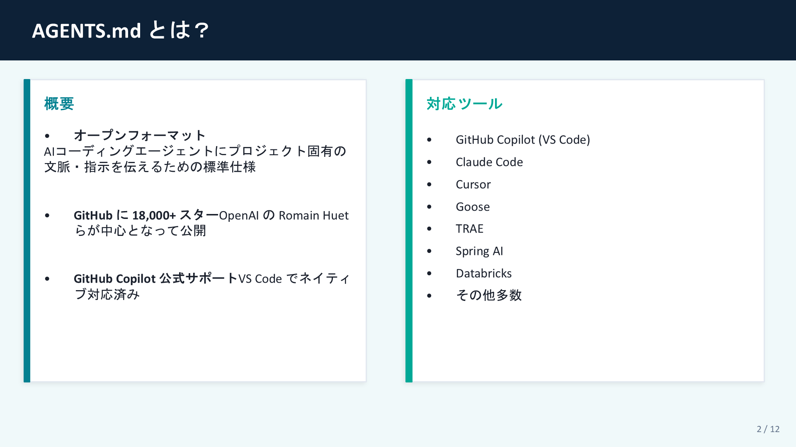
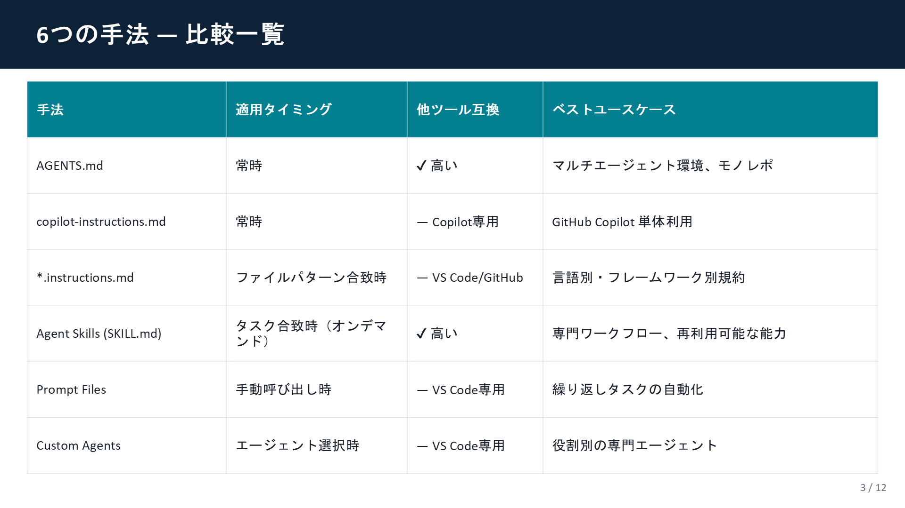
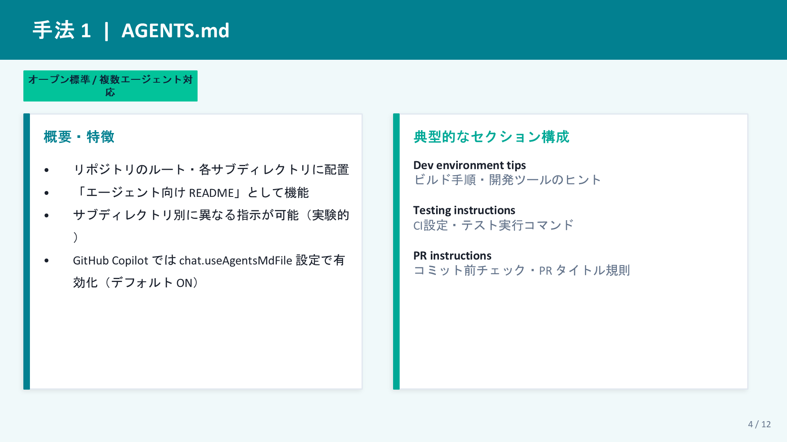
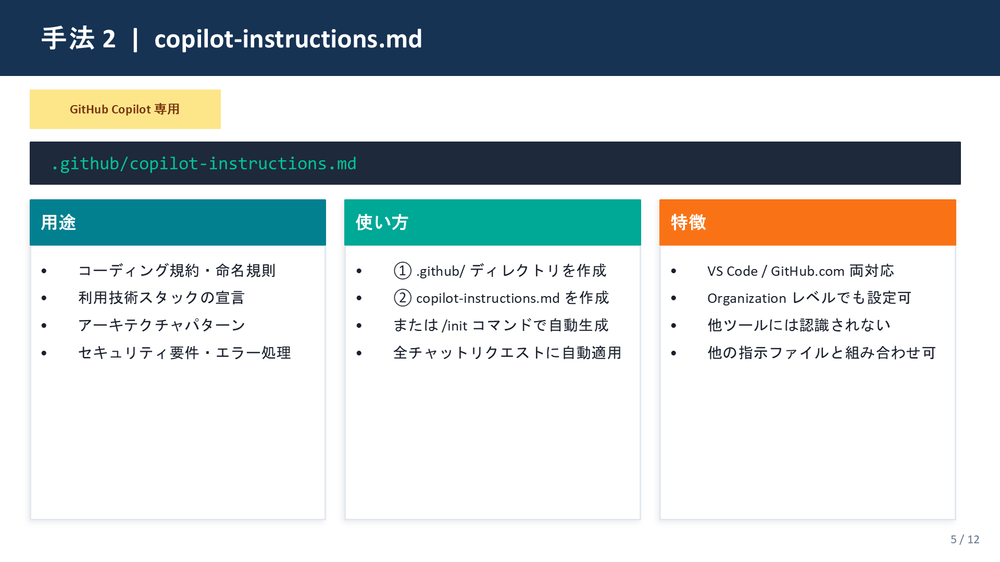
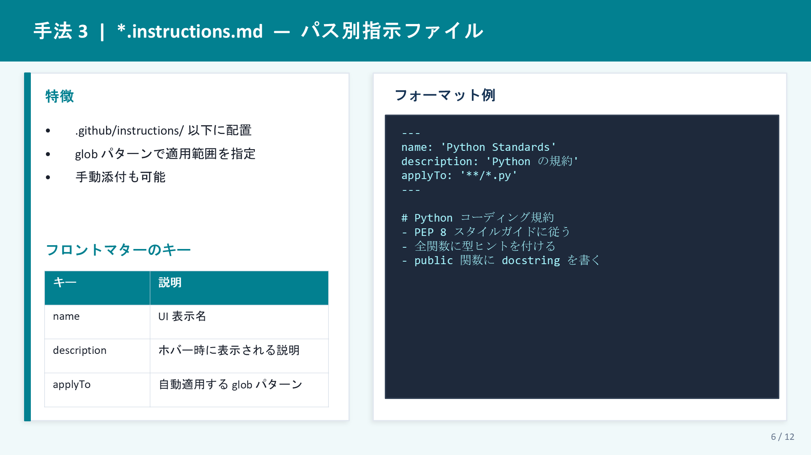
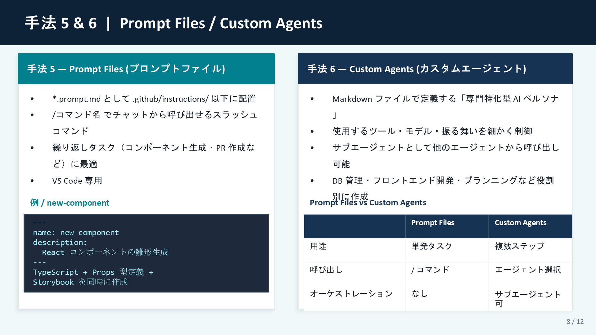
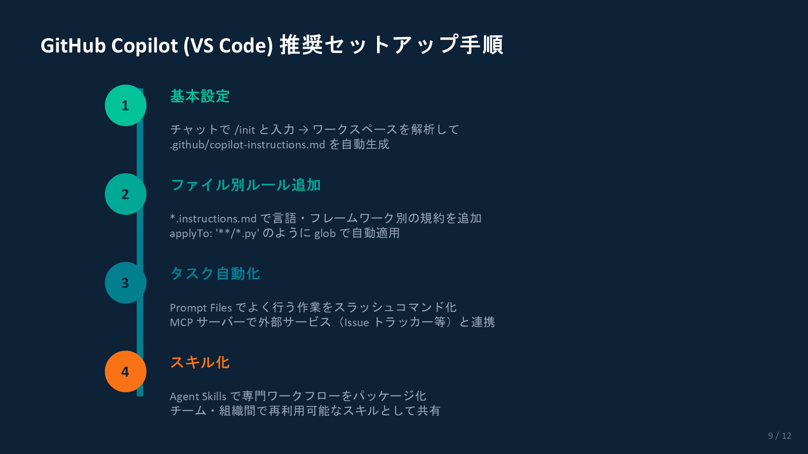
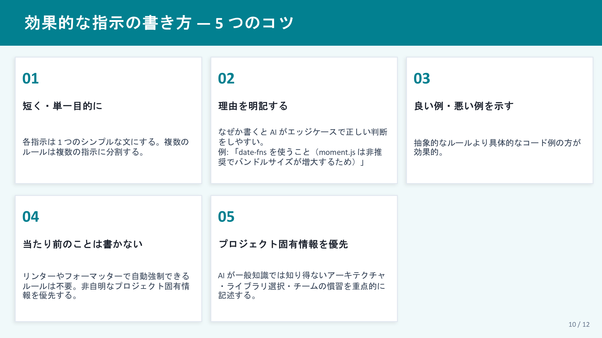
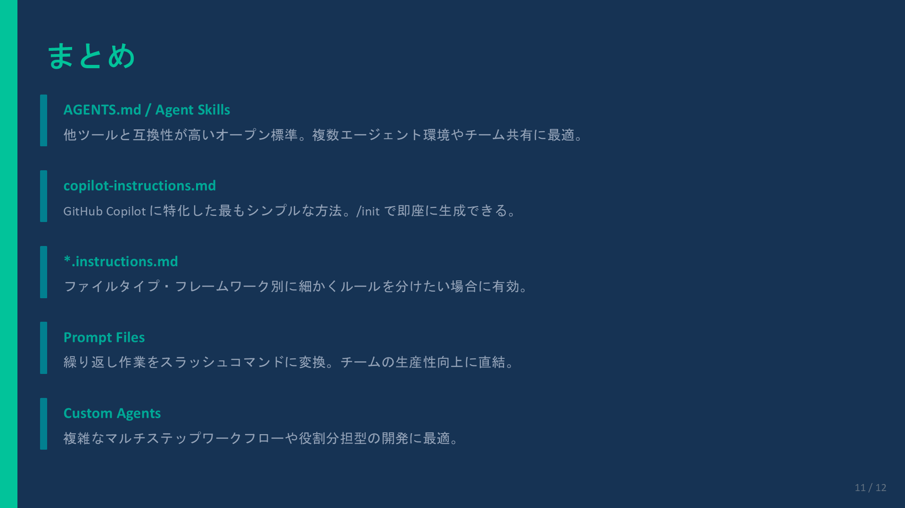
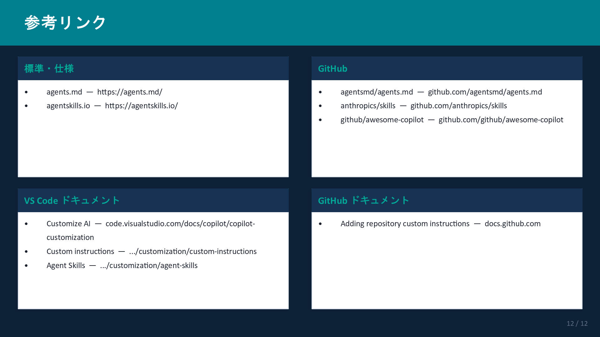

# AGENTS.md を活用したエージェント指示・スキル設定 — スライド一覧

[AGENTS_md_手法まとめ.pptx](AGENTS_md_手法まとめ.pptx) の全12スライドを画像で参照できます。

---

## Slide 1 — タイトル

---

## Slide 2 — AGENTS.md とは？

---

## Slide 3 — 6つの手法 比較表

---

## Slide 4 — 手法1: AGENTS.md

---

## Slide 5 — 手法2: copilot-instructions.md

---

## Slide 6 — 手法3: *.instructions.md

---

## Slide 7 — 手法4: Agent Skills (SKILL.md)

---

## Slide 8 — 手法5 & 6: Prompt Files / Custom Agents

---

## Slide 9 — 推奨セットアップ手順

---

## Slide 10 — 効果的な指示の書き方

---

## Slide 11 — まとめ

---

## Slide 12 — 参考リンク

